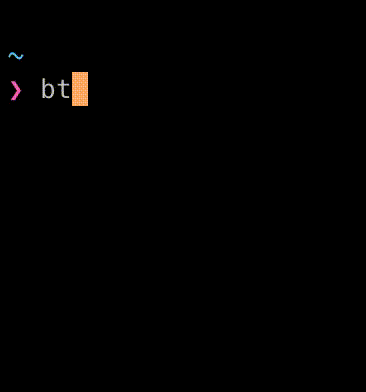

# Mac BT CLI toggle

Turn a BT device on and off on a Mac's CLI.

## Installation

1. Install blueutil:
    brew install blueutil
1. Find the device address using `blueutil --paired` and update it in the `bt` script code.
1. Run `./bt`
1. Place the script in your path so that you can run 'bt' from everywhere

## Credit
[Control Bluetooth on Apple MacBook Pro from the Command Line](https://trevorsullivan.net/2019/07/30/control-bluetooth-on-apple-macbook-pro-from-the-command-line/)

